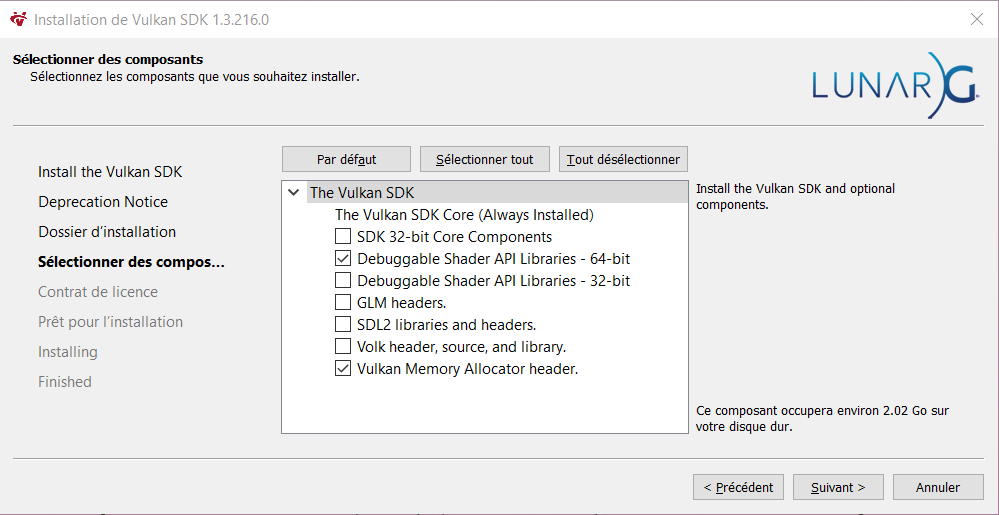

# HezEngine

## Getting Started
Visual Studio 2022 is recommended, but you can use any IDE that supports C++17.
Focus build on  Windows.

<ins>**1. Clone the repository:**</ins>

Start by cloning the repo with `git clone --recursive https://github.com/Hezaerd/HezEngine.git`

<ins>**2. Configuring dependencies:**</ins>
1. Run the [Setup.bat](https://github.com/Hezaerd/HezEngine/blob/main/scripts/Setub.bat) file found in `scripts` folder. This will download the requiered prerequisites if they are not already present.
2. One prerequisite is the Vulkan SDK. If it is not installed, the script will execute the `VulkanSDK.exe` file, and will prompt the user to install the SDK.
3. After installation, run the [Setup.bat](https://github.com/Hezaerd/HezEngine/blob/main/scripts/Setub.bat) file again. If the Vulkan SDK is installed properly, you will need to download the Vulkan SDK Debug Libraries. The script will prompt the user to download the Debug Libraries.
4. After downloading and installing everything, the [GenerateProject.bat](https://github.com/Hezaerd/HezEngine/blob/main/scripts/GenerateProjects.bat) will be executed automatically. This will generate the Visual Studio solution and project files.

*Tips : No need to rerun the entire `setup.bat` after! Just build the `Premake` project in Visual Studio to regenerate the solution and project files.*

### How to install the Vulkan SDK Debug Libraries
HezEngine requires Vulkan SDK 1.3.216.0 to be installed, and the VULKAN_SDK environment variable set to your installation path. If you do not have the correct version installed, the Setup script should offer to download and install the correct version for you.

The Vulkan SDK installer now offers to download and install shader debug libraries - you must install these libraries if you would like to build HezEngine in the Debug configuration. To do so, simply check the (Optional) Debuggable Shader API Libraries - 64 bit option in the Select Components part of the installer, as seen in the image below. 
(*yes the screen is in french cause baguette baguette*)
